# UAV Photo Optimizer 方法學與成果檢核說明書

> 版本：0.5.0<br>
> 更新日期：2026-09-15<br>
> 適用對象：航拍成果檢核人員、測繪專案管理人員、品質審查人員<br>
> 工具定位：依 metadata 與局部 DSM 幾何進行「候選照片減量」，不是建模成果驗收軟體

## 目錄

1. [檢核結論先讀](#1-檢核結論先讀)
2. [方法學證據鏈](#2-方法學證據鏈)
3. [高程修正](#3-高程修正)
4. [DSM 局部地形保護](#4-dsm-局部地形保護)
5. [單張適格性與保守旁路](#5-單張適格性與保守旁路)
6. [Footprint 與重疊率模型](#6-footprint-與重疊率模型)
7. [前向重疊篩選](#7-前向重疊篩選)
8. [旁向航帶重疊與回補](#8-旁向航帶重疊與回補)
9. [決策狀態與報告證據](#9-決策狀態與報告證據)
10. [804 張實際成果檢核範例](#10-804-張實際成果檢核範例)
11. [成果檢核流程](#11-成果檢核流程)
12. [不可超出的宣稱邊界](#12-不可超出的宣稱邊界)
13. [追溯資源](#13-追溯資源)

## 1. 檢核結論先讀

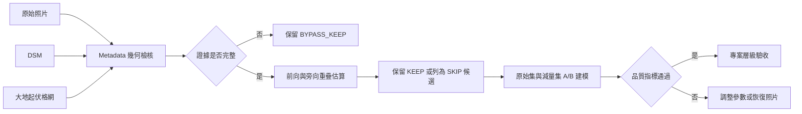

檢核時必須先把三種結論分開：

| 層級 | 程式能說明的事 | 程式不能說明的事 |
|---|---|---|
| 單張照片 | metadata 與局部地形證據是否足夠 | 照片清晰度、動態模糊、紋理品質 |
| 重疊幾何 | 估算矩形 footprint 的前向／旁向區間重疊 | 實際影像特徵點是否充足 |
| 減量決策 | 哪些照片可列為 `SKIP` 候選 | 直接刪除原始檔的授權 |
| 建模成果 | 無；`modeling_validation_status` 維持 `NOT_RUN` | 空三、點雲、DSM、正射成果品質 |

> [!IMPORTANT]
> `PASS` 代表 metadata 矩形幾何通過，不等於攝影測量建模品質通過。`SKIP` 只是候選清單，正式驗收前必須進行原始集與減量集的 A/B 建模。

## 2. 方法學證據鏈

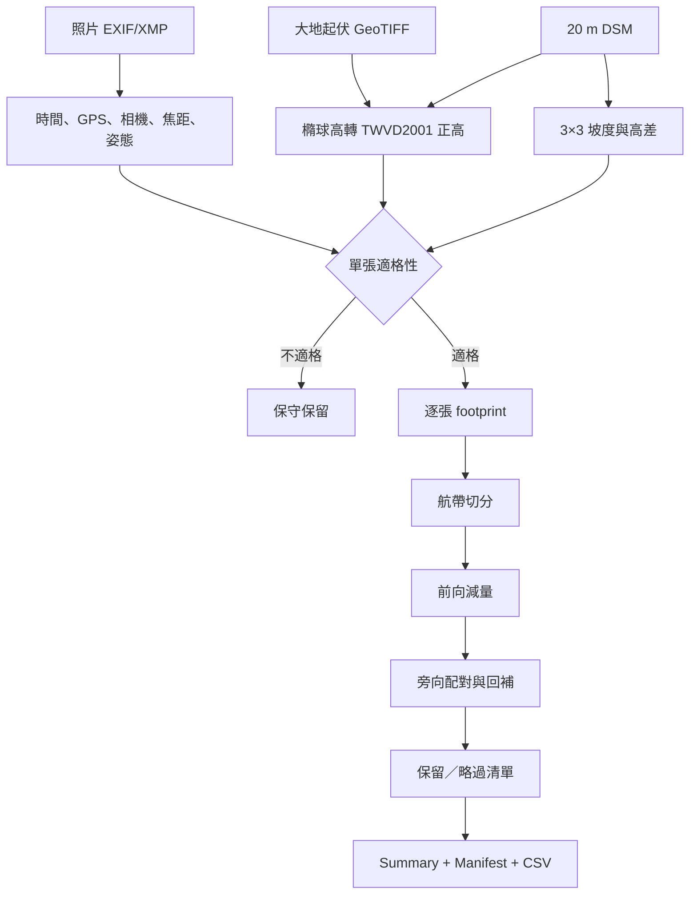

證據的信任原則是「缺證即保留」：

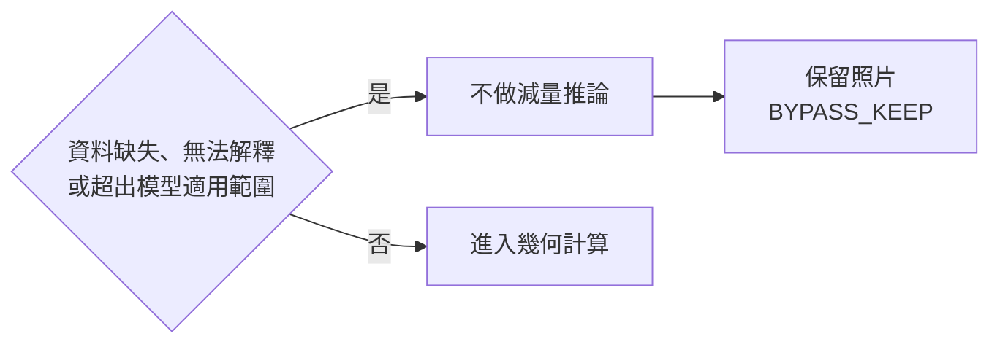

## 3. 高程修正

### 3.1 為什麼必須修正

照片 `GPSAltitude` 在本資料集的 XMP `VertCS` 標示為橢球高；DSM 高程則以設定明示宣告為 TWVD2001 正高。兩者不可直接相減。

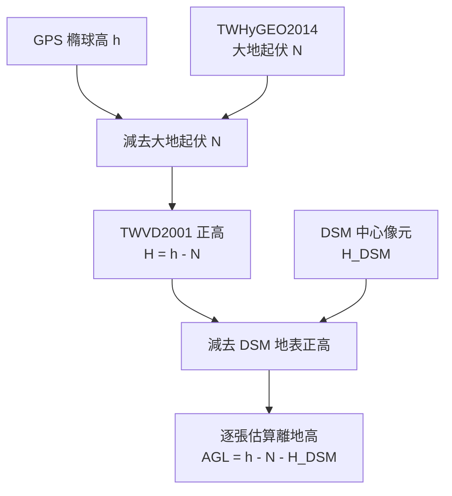

$$
H = h - N
$$

$$
AGL = H - H_{DSM} = h - N - H_{DSM}
$$

| 符號 | 內容 | 基準／單位 | 查核證據 |
|---|---|---|---|
| `h` | 照片 GPS 高 | 橢球高，m | `vendor_vertical_reference = ellipsoidal` |
| `N` | 大地起伏 | `h - H`，m | GeoTIFF tag、SHA-256、雙線性插值 |
| `H` | 照片正高 | TWVD2001，m | `h - N` 推導值 |
| `H_DSM` | DSM 中心像元高程 | 設定宣告 TWVD2001，m | `dsm_surface_height_m` |
| `AGL` | 幾何用離地高 | m | `estimation_height_m` |

### 3.2 大地起伏格網的信任鏈

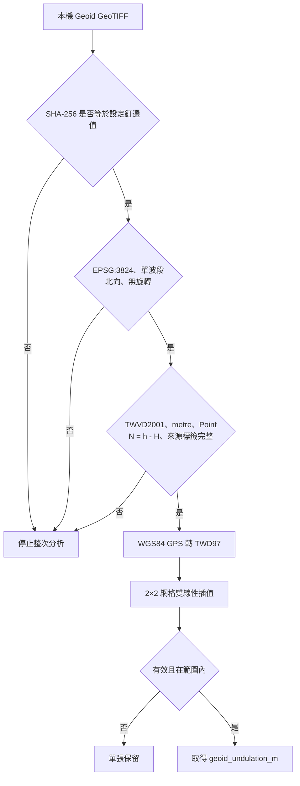

格網檔案的 SHA-256 是內容身分釘選；即使標籤不變，任一位元改變也會拒絕分析。這項設計防止誤用其他大地水準面模型或損壞檔案。

> [!CAUTION]
> DSM GeoTIFF 本身沒有編碼垂直 CRS。`dsm_vertical_datum = TWVD2001` 是依資料集來源做的明示設定宣告，不是從 GeoTIFF 內部自動證明。檢核報告必須保留此限制。

### 3.3 修正值如何參與篩選

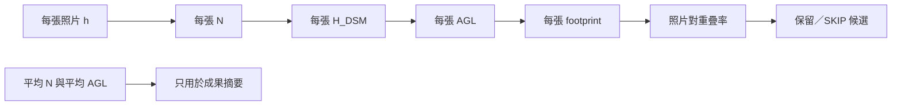

平均大地起伏與平均 AGL 不會被回填到照片，也不參與單張決策。真正參與篩選的是每張照片的 `estimation_height_m`。

## 4. DSM 局部地形保護

### 4.1 3×3 視窗

|  | 西 | 中 | 東 |
|---|---:|---:|---:|
| 北 | `z1` | `z2` | `z3` |
| 中 | `z4` | **`z5` 照片 GPS 點** | `z6` |
| 南 | `z7` | `z8` | `z9` |

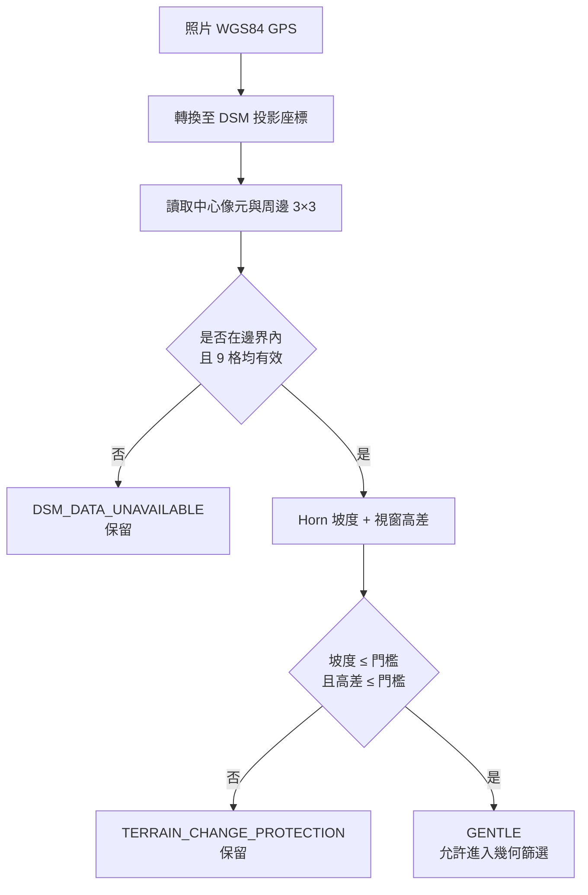

Horn 中心坡度使用：

$$
\frac{\partial z}{\partial x} =
\frac{(z_3 + 2z_6 + z_9) - (z_1 + 2z_4 + z_7)}{8\Delta x}
$$

$$
\frac{\partial z}{\partial y} =
\frac{(z_7 + 2z_8 + z_9) - (z_1 + 2z_2 + z_3)}{8\Delta y}
$$

$$
slope = \tan^{-1}\left(
\sqrt{\left(\frac{\partial z}{\partial x}\right)^2 +
\left(\frac{\partial z}{\partial y}\right)^2}
\right)
$$

$$
relief = \max(z_1,\ldots,z_9) - \min(z_1,\ldots,z_9)
$$

本次中度設定為坡度 `≤ 15°`、3×3 高差 `≤ 20 m`。兩項必須同時通過才是 `GENTLE`。

### 4.2 DSM 保護能與不能代表的範圍

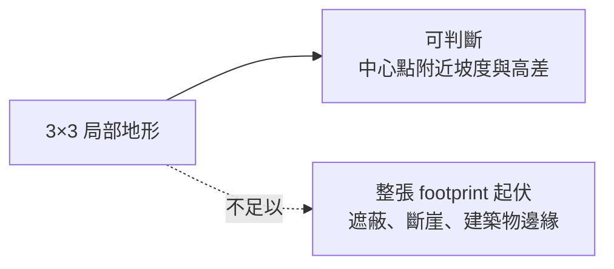

20 m 是 DSM 的水平網格間距，不是高程精度，也不表示已檢查整張照片投影範圍。

## 5. 單張適格性與保守旁路

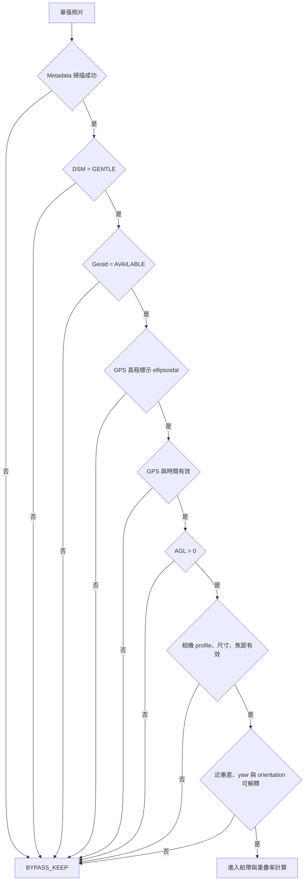

| 保留原因 | 檢核意義 |
|---|---|
| `TERRAIN_CHANGE_PROTECTION` | DSM 局部地形超出門檻 |
| `DSM_DATA_UNAVAILABLE` | DSM 缺值、邊界或範圍外 |
| `GEOID_DATA_UNAVAILABLE` | 無法安全取得 `N` |
| `GPS_VERTICAL_REFERENCE_UNCONFIRMED` | 無法證明 GPS 高是橢球高 |
| `HEIGHT_REFERENCE_UNCERTAIN` | 高程缺失或校正後 AGL 非正值 |
| `NADIR_GEOMETRY_UNCERTAIN` | 相機不是可接受的近垂直姿態 |
| `CAMERA_PROFILE_MISSING_OR_SIZE_MISMATCH` | 無法證實感光元件與影像尺寸 |
| `FOCAL_LENGTH_INVALID` | 焦距無法用於 footprint |
| `GPS_INVALID` / `CAPTURE_TIME_INVALID` | 空間或時間序列不可信 |

## 6. Footprint 與重疊率模型

### 6.1 逐張矩形 footprint

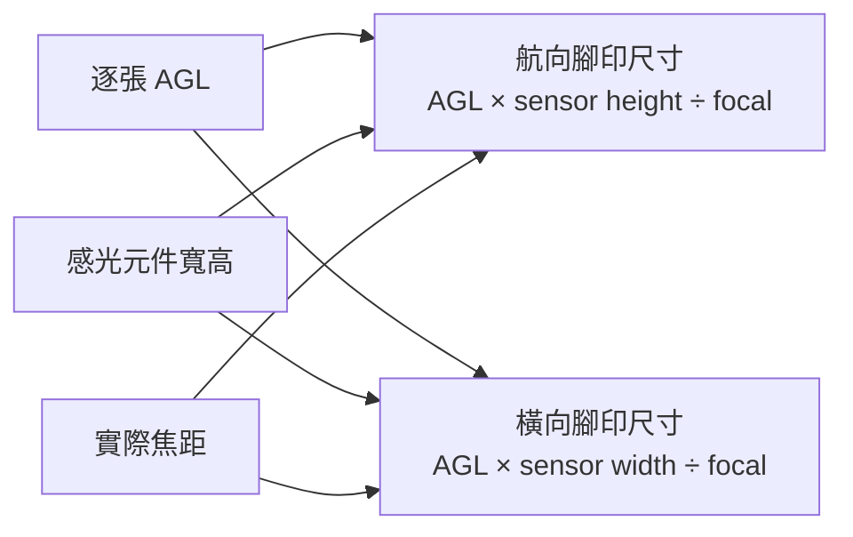

$$
L = AGL \times \frac{sensor\ height}{focal\ length}
\qquad
W = AGL \times \frac{sensor\ width}{focal\ length}
$$

相機移動可沿影像長軸或短軸；程式依移動方位與 yaw 對齊關係決定何者是沿航向尺寸。斜向、航向不一致或橫向偏移過大時，不強行推估。

### 6.2 一維區間重疊，不是面積重疊

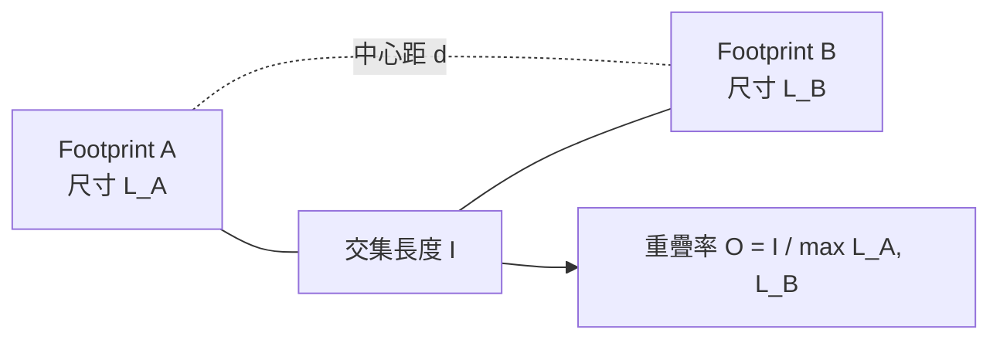

$$
I = \max\left(0,
\min\left(\frac{L_A}{2}, d + \frac{L_B}{2}\right)
- \max\left(-\frac{L_A}{2}, d - \frac{L_B}{2}\right)
\right)
$$

$$
O = \frac{I}{\max(L_A,L_B)}
$$

以較大 footprint 為分母，可避免高度不同時用較小 footprint 產生過於樂觀的重疊率。這是區間幾何，不是像素級影像面積交集。

## 7. 前向重疊篩選

### 7.1 航帶切分

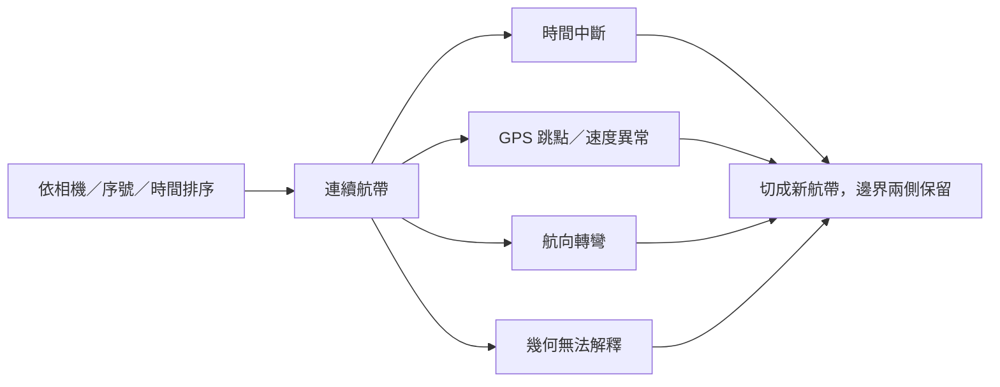

### 7.2 錨點、候選與安全橋接

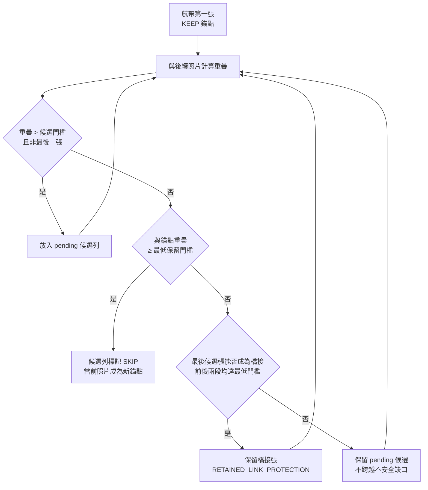

中度設定的候選門檻與最低保留前向重疊皆為 `70%`。每條航帶的首尾照片保留，篩選後再獨立重算相鄰保留錨點的 `retained_overlap`。

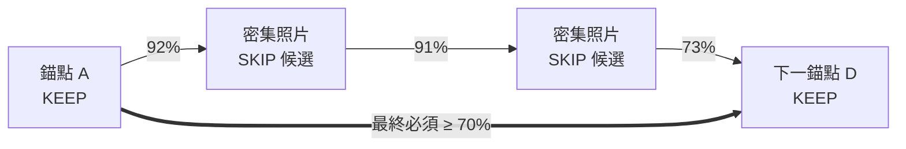

> [!NOTE]
> `retained_link_status = FAIL` 不一定代表篩選造成缺口。若原始相鄰照片本來就低於門檻，程式不會跨過它略過照片，但仍會將原始缺口寫為 `ORIGINAL_LINK_GAP_OR_UNCERTAINTY`。

## 8. 旁向航帶重疊與回補

### 8.1 可配對航帶的條件

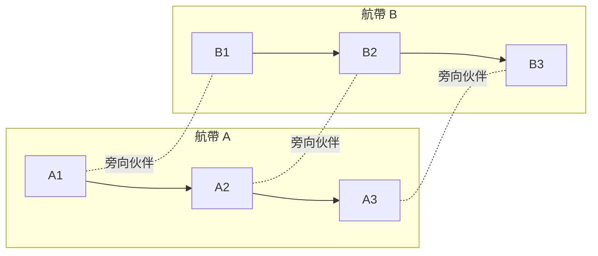

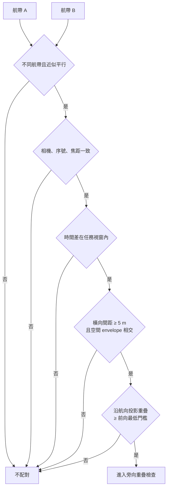

中度設定允許的航向差為 `15°`、任務時間視窗為 `1,800 s`、最低旁向重疊為 `70%`。不同日期或相隔過久的重飛不能互相補足覆蓋。

### 8.2 旁向回補邏輯

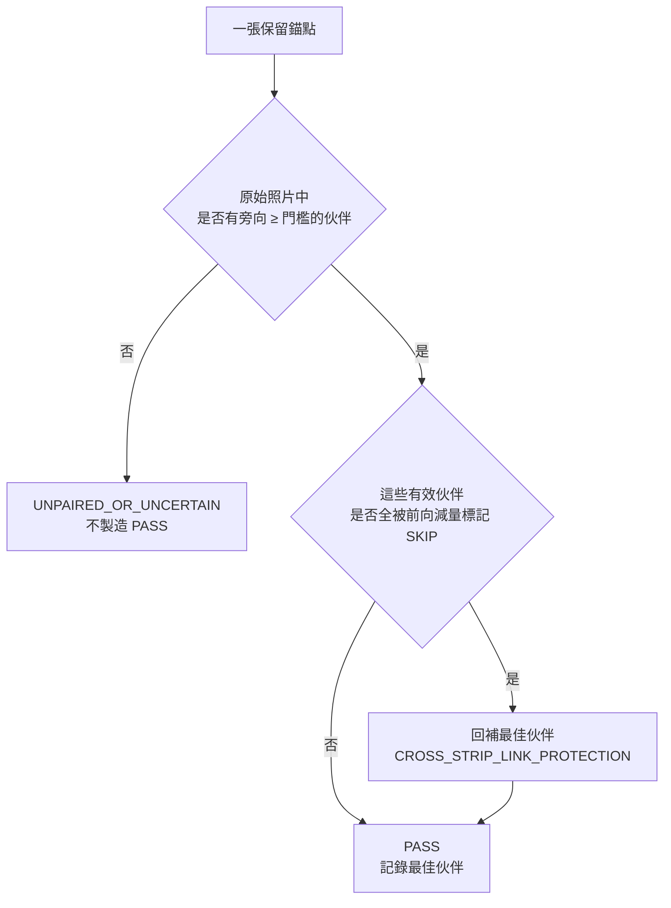

回補只修復「減量造成」的伙伴消失。如果原始資料就無法找到合格伙伴，程式會誠實標記不確定，不會把它變成 PASS。

### 8.3 整體狀態與減量子集狀態

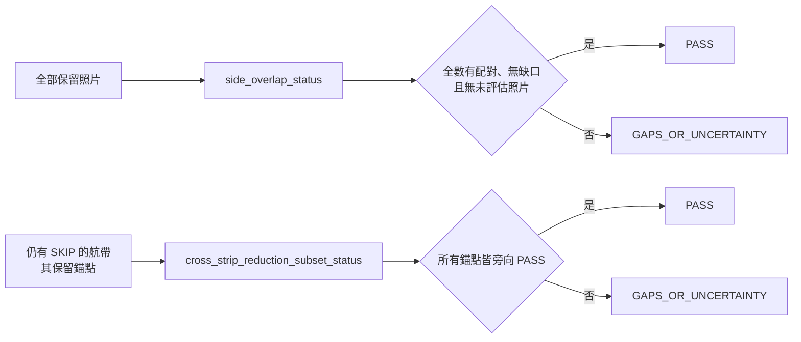

整體狀態與減量子集狀態必須分開解讀。粗糙地形照片雖然被保留，但沒有進入矩形幾何旁向計算，因此整體狀態通常不會是 PASS。

## 9. 決策狀態與報告證據

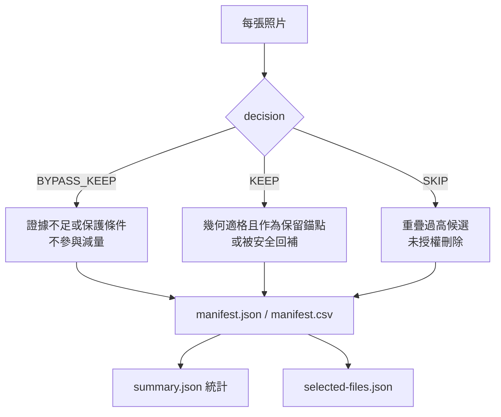

### 9.1 Summary 必查欄位

| 欄位 | 檢核重點 |
|---|---|
| `algorithm_version` | 應與本說明書版本一致 |
| `config_snapshot` | 門檻、基準宣告、Geoid SHA-256 的快照 |
| `result_classification` | 校正模式應為 `METADATA_GEOMETRY_CONFIG_DECLARED_TWVD2001_GEOID_CORRECTED` |
| `height_assumption` | 應明示 `h - N - config-declared TWVD2001 DSM` |
| `dsm` / `geoid` | 檔名、SHA-256、CRS、解析度、基準、公式與限制 |
| `dsm_status_counts` / `geoid_status_counts` | 格網可用性分布 |
| `decision_counts` / `reason_counts` | 保留、略過與保護原因統計 |
| `retained_link_counts` | 前向保留鏈 PASS／FAIL／UNKNOWN |
| `cross_strip_*` | 旁向配對、回補、缺口、未配對與子集狀態 |
| `copy_requested` | `false` 表示本次只產生報告 |
| `modeling_validation_status` | 未執行 A/B 建模時必須是 `NOT_RUN` |

### 9.2 Manifest 必查欄位

| 類別 | 欄位 |
|---|---|
| 身分與來源 | `photo_id`, `relative_path`, `size_bytes`, `capture_time` |
| 高程證據 | `absolute_altitude`, `vendor_vertical_reference`, `geoid_undulation_m`, `dsm_surface_height_m`, `estimation_height_m` |
| DSM 保護 | `dsm_status`, `dsm_slope_deg`, `dsm_relief_m` |
| 前向決策 | `strip_id`, `decision`, `reasons`, `candidate_anchor_id`, `candidate_overlap`, `restored` |
| 前向結果鏈 | `previous_retained_id`, `retained_overlap`, `retained_link_status` |
| 旁向結果鏈 | `cross_strip_status`, `cross_strip_partner_id`, `side_overlap`, `cross_strip_along_overlap`, `cross_strip_restored` |

## 10. 804 張實際成果檢核範例

### 10.1 資料與高程

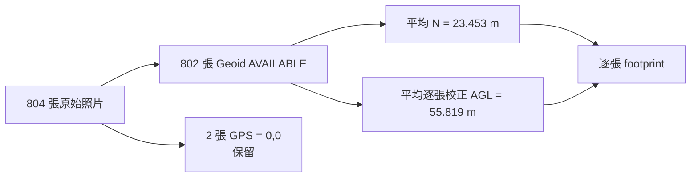

`23.453 m` 與 `55.819 m` 是整批描述統計；決策使用的仍是逐張 `N` 與逐張 AGL。

### 10.2 篩選成果

```mermaid
flowchart TD
    RAW[804 張] --> PROTECT[622 張<br/>地形或幾何保護]
    RAW --> ELIGIBLE[182 張<br/>進入幾何篩選]
    ELIGIBLE --> KEEP[85 張保留]
    ELIGIBLE --> SKIP[97 張 SKIP 候選]
    KEEP --> TOTAL[707 張最終保留]
    PROTECT --> TOTAL
    SKIP --> SAVE[候選減少 12.065%<br/>2.302 GB]
```

| 檢核項目 | 結果 | 解讀 |
|---|---:|---|
| 最終保留 | 707 張 | 包含 622 張保護照片 |
| `SKIP` 候選 | 97 張 | 12.065%，2,301,586,100 bytes |
| 前向 PASS | 53 條 | 最低確認重疊 70.635% |
| 前向原始缺口 | 4 條 | 未跨越缺口略過，但仍須列管 |
| 旁向 PASS 保留點 | 40 張 | 最低確認旁向重疊 70.098% |
| 旁向回補 | 2 張 | 修復減量造成的伙伴消失 |
| 未配對／不確定 | 45 張 | 不可宣稱全體旁向 PASS |
| 整體旁向狀態 | `GAPS_OR_UNCERTAINTY` | 622 張未納入矩形旁向評估 |
| 減量子集旁向狀態 | `GAPS_OR_UNCERTAINTY` | 仍有原始配對不確定 |

### 10.3 舊高程公式與校正後結果

```mermaid
flowchart LR
    OLD[舊式 h - H_DSM<br/>平均 footprint 高度 79.272 m] --> O[120 張 SKIP 候選]
    NEW[校正 h - N - H_DSM<br/>平均 footprint 高度 55.819 m] --> N[97 張 SKIP 候選]
    O -. 高估 footprint .-> D[校正後多保留 23 張<br/>少列 552,295,053 bytes]
    N --> D
```

這個差異說明高程基準不只影響報告數字，還會直接改變 footprint 與篩選決策。校正後的 footprint 較小，因此程式更保守地保留照片。

## 11. 成果檢核流程

```mermaid
flowchart TD
    A[收到 summary + manifest + config] --> B[核對版本、參數與 SHA-256]
    B --> C[核對高程公式與垂直基準限制]
    C --> D[核對 DSM / Geoid 狀態數]
    D --> E[抽查 BYPASS_KEEP 原因]
    E --> F[抽查 SKIP 的前後保留鏈]
    F --> G[抽查旁向 partner 與回補]
    G --> H{有 FAIL、UNKNOWN<br/>或 GAPS_OR_UNCERTAINTY}
    H -- 是 --> I[列入風險與 A/B 建模重點]
    H -- 否 --> J[仍進行 A/B 建模]
    I --> K[比較空三、tie points、再投影誤差<br/>密點雲、DSM / 正射空洞與完整度]
    J --> K
    K --> L{專案品質門檻通過}
    L -- 否 --> M[恢復照片或提高重疊門檻]
    L -- 是 --> N[核准減量集]
```

### 11.1 建議檢核清單

- [ ] `algorithm_version` 與指定版本一致。
- [ ] `config_snapshot` 與核定參數一致，無臨時門檻覆寫。
- [ ] DSM 與 Geoid 檔案 SHA-256 與交付清單一致。
- [ ] Geoid 的 target datum、offset convention、unit 與 point semantics 正確。
- [ ] DSM 垂直基準來源文件已隨成果交付。
- [ ] `raw = selected + skipped`，張數與 bytes 統計可由 Manifest 重算。
- [ ] `selected-files.json` 與 Manifest 中非 `SKIP` 集合完全一致。
- [ ] 所有 `SKIP` 均有 `EXCESSIVE_FORWARD_OVERLAP`，並可追溯錨點。
- [ ] 前向 `FAIL` / `UNKNOWN` 已逐條判讀，無篩選跨越原始缺口。
- [ ] `cross_strip_restored` 可追溯到原本有效但曾被略過的伙伴。
- [ ] `GAPS_OR_UNCERTAINTY` 未被文字報告改寫為「旁向重疊合格」。
- [ ] `modeling_validation_status = NOT_RUN` 時，結論未宣稱建模品質合格。
- [ ] 已完成原始集與減量集 A/B 建模並留存可重現設定。

## 12. 不可超出的宣稱邊界

```mermaid
flowchart LR
    OK[可宣稱] --> O1[已依指定 metadata 與參數執行]
    OK --> O2[已用 h - N - H_DSM 估算逐張高度]
    OK --> O3[已產生可追溯的候選清單]
    NO[不可僅依本報告宣稱] --> N1[實際重疊面積全數達標]
    NO --> N2[建模無空洞或精度合格]
    NO --> N3[DSM 已檢查整張 footprint]
    NO --> N4[SKIP 照片可直接刪除]
```

其他限制：

- 不解碼照片像素，無影像特徵點與遮蔽分析。
- 只對近垂直、移動方向可對齊影像主軸的照片進行矩形模型。
- DSM 只檢查 GPS 點周邊 3×3 網格，不是 footprint-wide terrain projection。
- 旁向配對是局部平面矩形近似，不是立體地形上的實際影像重疊。
- 本工具不修改原始照片；預設只寫報告，只有明示 `--copy` 才複製保留檔。

## 13. 追溯資源

- [專案驗證紀錄](validation.md)
- [設計決策](design.md)
- [校正後 XT701 中度 70% 設定](../config/xt701-dsm70-cross70-moderate-twvd2001.json)
- [國土測繪中心：TWVD2001](https://www.nlsc.gov.tw/cp.aspx?n=1483)
- [政府資料開放平臺：全台 20 m DSM](https://data.gov.tw/dataset/169808)
- [QPS：TWHyGEO2014 pre-release redistribution](https://qpssoftware.scrollhelp.site/geodeticui/download-pre-released-vertical-models)
